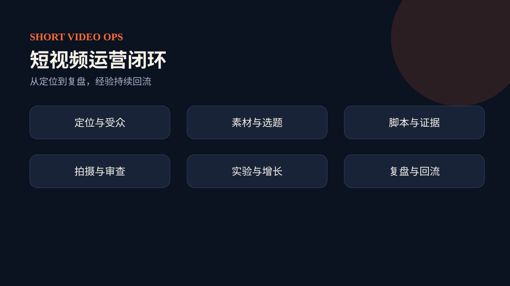

# Short Video Operations Pack

一套把短视频从“凭感觉发内容”变成“有任务单、有证据、有实验、有复盘”的开源 Skill 包。

**适用对象：**短视频创作者、内容团队和需要多轮协作的 Agent 用户。**当前状态：**`v0.1.0-alpha.3` 公开预发布候选，13 个 Skill 的结构与测试已验证。**下一步：**按下面的固定版本安装路径完成第一次调用；发布、投放、付费和直播仍须人工授权。English readers: [README.en.md](README.en.md).

它由 1 个总控 Skill、12 个专业 Skill 和 1 份共享任务单组成，覆盖定位、受众、素材、选题、脚本、证据、拍摄、审查、发布实验、付费增长、直播承接和效果复盘。

## 它解决什么问题

- 不知道账号该做什么：用定位和受众证据收窄方向。
- 有灵感但不能稳定生产：用素材库、选题评分和脚本策略形成流水线。
- 内容看起来不错但风险高：用证据规划和内容审查控制失实承诺。
- 发完只看播放量：用发布实验和同口径复盘找到可重复的增长原因。
- 多人或多轮协作断层：所有 Skill 都读写同一个 `ShortVideoOpsJob`，保留版本、责任和下一步。

## 总控与路由

当你的任务跨越两个以上运营环节，或需要从历史任务继续时，先调用总控 `short-video-operations`。只解决一个明确问题时，直接调用对应专业 Skill。它不会替你自动发布、花钱投放或开播；这些动作必须人工授权。

## 安装与第一次调用

1. 下载固定版本：`git clone --branch v0.1.0-alpha.3 --depth 1 https://github.com/slalomboy/short-video-operations-pack.git`。
2. 把仓库中的 `skill-pack/` 安装到支持 Agent Skills 的工具中；扁平发现模式可执行 `python3 skill-pack/scripts/install_runtime_entrypoints.py skill-pack <skill-root>`。
3. 复制[共享任务单模板](skill-pack/shared/templates/ShortVideoOpsJob.json)。
4. 发出请求：“使用 `short-video-operations`，为这个新账号建立定位并给出首批选题，只做到计划，不发布。”
5. 根据返回的 `nextActions` 继续，而不是每次重新描述全部背景。

## Skill 地图

总控是 [`short-video-operations`](https://github.com/slalomboy/short-video-operations-pack/tree/v0.1.0-alpha.3/skill-pack/skills/short-video-operations)。12 个专业子 Skill 分别负责定位、受众、素材、选题、脚本、证据、镜头、审查、发布实验、付费增长、直播承接和效果复盘；它们共享同一仓库版本，不重复作为独立仓库发布。完整固定版本目录见 [`skill-pack/skills`](https://github.com/slalomboy/short-video-operations-pack/tree/v0.1.0-alpha.3/skill-pack/skills)。

## 学习入口

- [能力与边界](docs/00-overview/capabilities-and-boundaries.md)
- [六阶段学习路线](docs/02-learning-path/six-stage-path.md)
- [13 个 Skill 使用手册](docs/03-skills/README.md)
- [共享任务单教程](docs/04-job-contract/README.md)
- [7 条端到端实战流程](docs/05-workflows/README.md)
- [安全、真实性与人工授权](docs/06-governance/safety-and-approval.md)
- [FAQ 与故障排查](docs/07-reference/faq.md)

## 版本与兼容性

当前版本：`v0.1.0-alpha.3`。这是预发布版本；JSON schema 和字段所有权是协作契约。源码与 Markdown 对 macOS、Linux、Windows 使用同一版本，不提供平台二进制包。

## 验证范围

已验证 13/13 个 Skill、31/31 项自动测试和临时目录安装回读。验证证明结构、任务契约、路由与安全覆盖有效，不代表平台账号已登录，也不保证流量、转化或收益。`short-video-paid-growth` 与 `short-video-live-conversion` 仅保留有界决策入口。

## 许可证、来源与隐私边界

本仓库公开的是原创 Skill 实现、操作方法、匿名示例和图解，不包含形成该方法时使用的原视频、逐字稿、逐条笔记、书稿或客户资料。

[English documentation](README.en.md) · [English docs index](docs/en/README.md) · [Apache-2.0](https://github.com/slalomboy/short-video-operations-pack/blob/v0.1.0-alpha.3/LICENSE) · [贡献指南](CONTRIBUTING.md)
