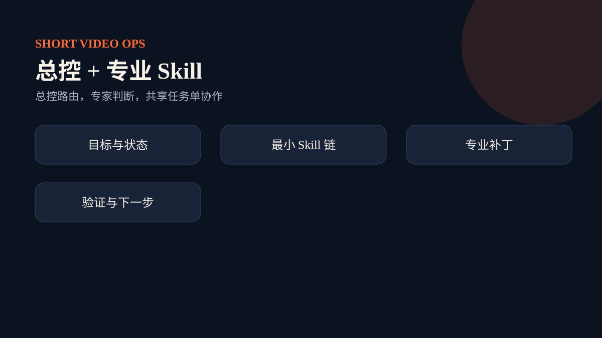

# 架构：总控、专业 Skill 与共享任务单

`short-video-operations` 根据目标和任务状态选择最小 Skill 链。专业 Skill 只写自己拥有的字段，返回带 `jobId`、`baseVersion`、`skill`、`writes`、`reviewItems` 的补丁。合并器拒绝过期版本和越权写入，验证器在每次合并后重新检查 schema 和业务门槛。

这种结构解决三类协作问题：不同角色互相覆盖结论；后续任务不知道前面发生了什么；把建议误当成已执行。共享任务单同时记录事实、证据、状态、版本、授权和下一动作。
