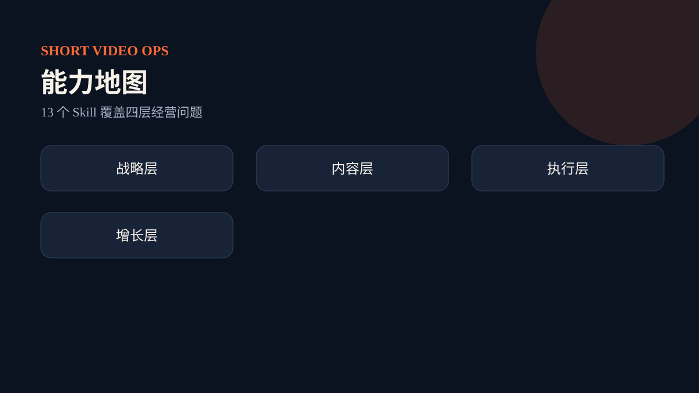

# 能力与边界

## 核心能力

这套 Skill 包把短视频工作拆成四层：战略层确定定位和受众；内容层管理素材、选题、脚本与证据；执行层准备拍摄并审查；增长层设计发布实验、付费增长、直播承接和复盘。总控只负责选择最小必要链路、检查依赖、合并补丁和管理状态。

## 它不是什么

它不是“一键爆款”承诺，不会用单条数据推翻长期定位，不会编造证据，也不会默认替用户发布、付费或开播。它不会代替剪辑软件、账号后台、广告平台或直播中控。

## 三个使用原则

1. 单点问题用专业 Skill，跨环节任务用总控。
2. JSON 任务单是事实源，Markdown 只是给人阅读的视图。
3. 计划、审查通过和真实执行是三个不同状态；外部动作必须明确授权。
