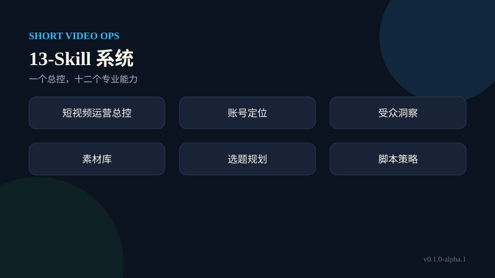

# 13 个 Skill 使用手册

总控用于跨环节协作；专业 Skill 用于一个边界清晰的任务。

1. [短视频运营总控 `short-video-operations`](short-video-operations.md)：跨两个以上环节时统一路由、状态、权限与补丁合并。
2. [账号定位 `short-video-positioning`](short-video-positioning.md)：账号方向不清、受众过宽或内容与变现脱节时确定长期边界。
3. [受众洞察 `short-video-audience-insight`](short-video-audience-insight.md)：需要用可核验证据理解受众问题、语言和决策阻力时。
4. [素材库 `short-video-material-library`](short-video-material-library.md)：来源分散、选题重复或好素材无法复用时建立可追溯资产库。
5. [选题规划 `short-video-topic-planning`](short-video-topic-planning.md)：多个想法需要按受众价值、证据和制作成本排序时。
6. [脚本策略 `short-video-script-strategy`](short-video-script-strategy.md)：选题已定，需要把承诺、结构、钩子和行动引导写成可拍脚本时。
7. [证据规划 `short-video-evidence-planning`](short-video-evidence-planning.md)：脚本涉及事实、产品效果、规则或案例，需要证明与降级表达时。
8. [拍摄规划 `short-video-shot-planning`](short-video-shot-planning.md)：脚本已审定，需要变成镜头、场景、道具和收音执行单时。
9. [内容审查 `short-video-content-review`](short-video-content-review.md)：发布前需要检查承诺、事实、结构、平台风险和可执行性时。
10. [发布实验 `short-video-publish-experiment`](short-video-publish-experiment.md)：内容通过审查后，需要设计可比较的发布变量和数据回收时。
11. [付费增长 `short-video-paid-growth`](short-video-paid-growth.md)：自然内容已有稳定信号，准备判断是否投放和如何止损时。
12. [直播转化 `short-video-live-conversion`](short-video-live-conversion.md)：短视频承诺要由直播承接，需要设计进房、讲解、成交与履约时。
13. [效果复盘 `short-video-performance-review`](short-video-performance-review.md)：同口径样本积累后，需要判断继续、停止和回流哪些经验时。
