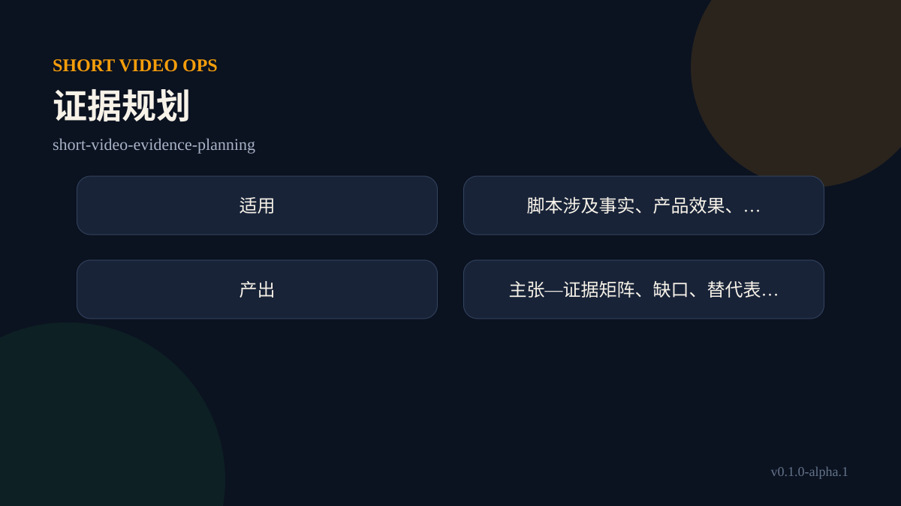

# 证据规划：`short-video-evidence-planning`

## 解决什么问题

脚本涉及事实、产品效果、规则或案例，需要证明与降级表达时。它把模糊请求收敛为可验证的输入、判断和下一步，避免把计划写成已经执行。

## 什么时候使用

当任务满足上述场景且所需输入基本具备时使用。由总控按依赖路由；不要为了形式把全部 Skill 跑一遍。 如果缺少关键事实，先把缺口写入 `reviewItems`，不得自行补造。

## 输入

最小输入包括：脚本主张、已有来源、素材许可；以及当前 `ShortVideoOpsJob` 的 `jobId`、版本、已有证据和授权状态。没有现成任务单时可由总控创建。

## 操作步骤

1. 读取 JSON 任务单、公共规则和字段所有权，确认基线版本。
2. 检查输入完整性、来源时效、相互冲突和外部行动权限。
3. 只处理本 Skill 拥有的字段，并把事实、推断和假设分开。
4. 输出最小补丁；未知、冲突或需要人工判断的内容进入 `reviewItems`。
5. 合并后重新验证任务单，刷新 Markdown 视图，并给出一个明确下一动作。

## 输出

主要产物：主张—证据矩阵、缺口、替代表达与停止项。机器可合并输出必须含 `jobId`、`baseVersion`、`skill`、`writes`、`reviewItems`；面向人的摘要要说明当前状态、依据、缺口和下一步。

## 验收标准

- 结论与证据、任务目标和版本一致。
- 只写本 Skill 拥有的字段，不覆盖其他专业结论。
- 未授权的发布、支出、开播、安装和外部写入仍为 `pendingApproval`。
- 下一动作具体、可执行，并说明由谁完成。

## 常见错误

- 输入不足时给出确定性结论。
- 跳过依赖，直接用后段数据反推前段战略。
- 把 Markdown 当事实源，或在旧版本上合并补丁。
- 用“审查通过”暗示已经发布或已经产生业务结果。

## 示例调用

“使用 `short-video-evidence-planning` 处理随附任务单。目标：脚本涉及事实、产品效果、规则或案例，需要证明与降级表达时。只输出你拥有字段的补丁，同时列出证据缺口和下一动作；不执行任何外部操作。”
