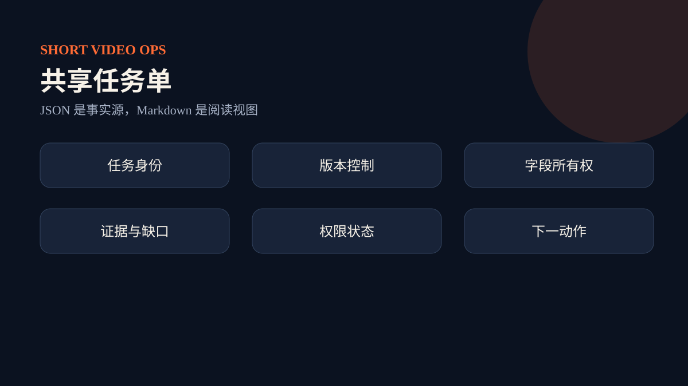

# ShortVideoOpsJob 共享任务单

任务单是 13 个 Skill 的共同事实源。`meta` 保存任务身份、版本和状态；各专业区保存定位、洞察、素材、选题、脚本、证据、制作、审查、实验、投放、直播和复盘；`governance` 保存授权和风险；`nextActions` 保存下一步。

## 版本与补丁

每个补丁声明 `baseVersion`。只有它与当前任务版本一致时才能合并；成功合并后版本递增。这样可以拒绝晚到的旧结论。字段所有权表决定每个 Skill 可写范围，越权补丁必须失败。

## reviewItems

对缺失证据、规则时效、冲突信息、人工选择和权限问题，不做无依据猜测，统一写入 `reviewItems`。处理完后才能进入依赖它的下游阶段。

## JSON 与 Markdown

JSON 是机器事实源。Markdown 由渲染脚本生成，只用于阅读和评审；两者冲突时以 JSON 为准。
