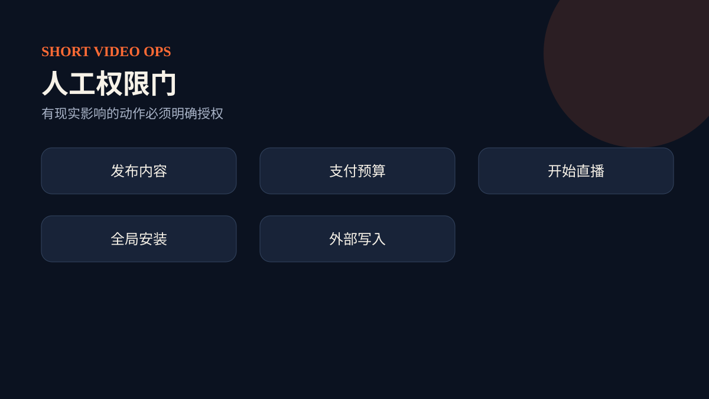

# 字段所有权与状态门

总控只管理 `meta`、`governance`、`nextActions`。每个专业 Skill 只能修改与其名称对应的业务区。这样既能并行产出候选补丁，又能防止一个角色静默覆盖另一个角色的判断。

状态推进不是“写完文档”就自动发生：证据缺口会阻止审查通过；内容未审查会阻止发布实验；自然样本不可比会阻止付费准入；承诺与履约不一致会阻止直播承接。真实发布、支出和开播在任何情况下都要求人工明确授权。
