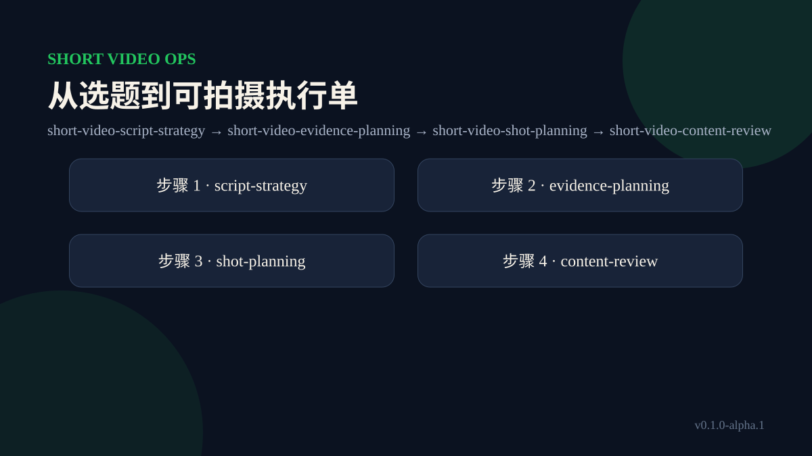

# 从选题到可拍摄执行单

## 目标

脚本、证据、镜头与审查连续衔接，避免拍完才发现无法证明。

## Skill 链

`short-video-script-strategy` → `short-video-evidence-planning` → `short-video-shot-planning` → `short-video-content-review`

## 执行方法

1. 从 `examples/workflows/03-script-to-shoot.json` 复制匿名任务单，确认目标、版本和缺口。
2. 依序调用最小 Skill 链；每一步只提交字段所有权允许的补丁。
3. 每次合并后运行任务单验证，冲突或缺证据时停止推进。
4. 对产出做人工评审，记录继续、退回或停止的理由。
5. 真实发布、预算、优惠或开播保持待授权；示例不会自动执行。

## 验收

输入、过程、产物、证据、版本与下一动作都能追溯；流程结论不越过人工权限门。示例中的品牌、人群和数据均为虚构教学数据。
